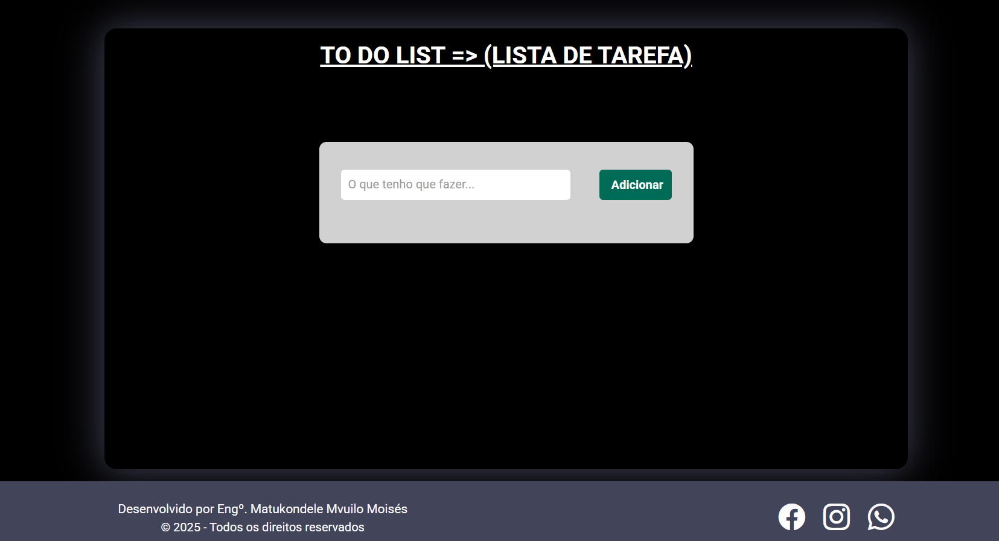
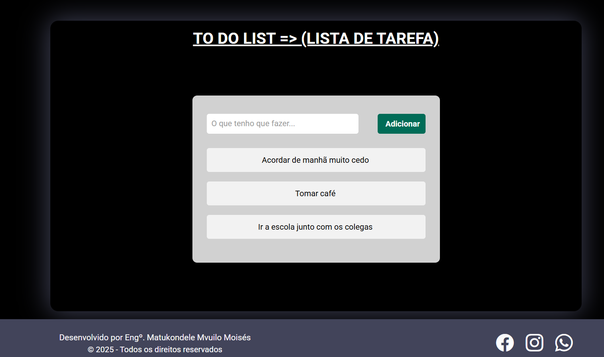
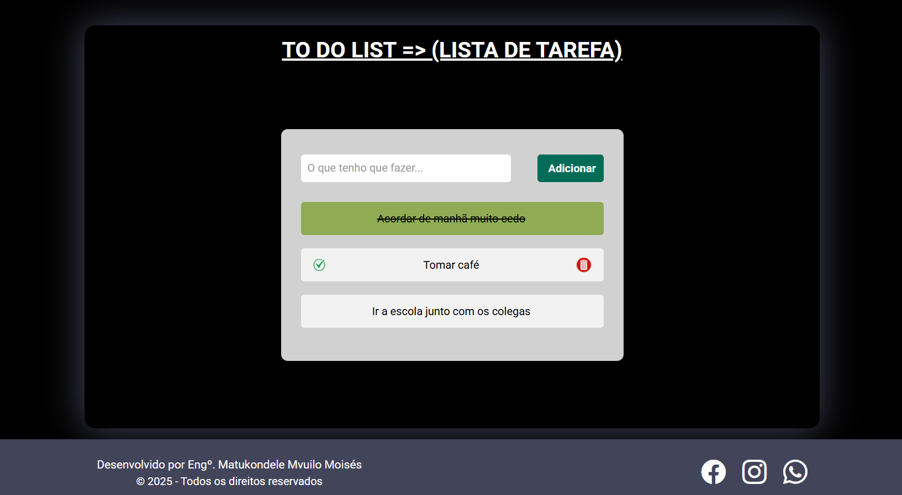

# to-do-list

 # Boa noite a todos! 🖐️ meu nome é Matukondele Mvuilo Moisés.

# Este é o web application de gerenciamento de tarefas diárias
### Criei este aplicativo web com intuito de ajudar amantes de tecnologia, para gerenciar suas tarefas diárias, usabilidade deste aplicativo não escolhe a classe de pessoas. Qualquer pessoa pode usar o aplicativo de adicionar, atualiar e ecluir tarefas conforme que quiser, em relação as necessidades.

## Tecnologias utilizadas: HTML, CSS e JAVASCRIPT

## O link do aplicativo: https://to-do-list-nine-coral-79.vercel.app/

